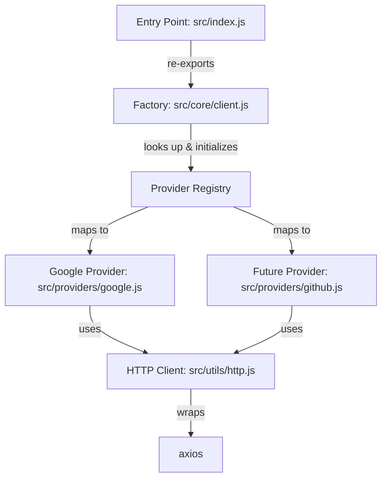

# Design Document: OAuth Provider Package

## Overview

This document describes the technical design for a lightweight, production-ready npm package that provides OAuth authentication via a factory pattern. The initial release supports Google OAuth 2.0, with an extensible architecture for adding providers (GitHub, Facebook, etc.) without modifying existing code.

The package exposes a single entry point — `createOAuthClient(config)` — which accepts a configuration object keyed by provider name and returns a client object with initialized provider instances. Each provider offers `getAuthUrl()` and `getToken(code)` methods for the standard OAuth 2.0 authorization code flow.

Key design goals:
- Minimal API surface: one named export (`createOAuthClient`)
- Strict config validation at initialization time with clear error messages
- Isolated provider modules under `providers/` for easy extensibility
- Shared HTTP utility (axios-based) for consistent request handling
- JSDoc annotations for TypeScript-compatible autocompletion

## Architecture

The package follows a layered architecture with three distinct layers:



**Layer 1 — Entry Point** (`src/index.js`): Re-exports `createOAuthClient` from the core module. This is the only public API surface.

**Layer 2 — Core Factory** (`src/core/client.js`): Contains the `createOAuthClient` function and the provider registry. The registry is a plain object mapping provider keys (e.g., `"google"`) to provider factory functions. For each key in the user's config that matches a registered provider, the factory validates the provider config and instantiates the provider.

**Layer 3 — Providers** (`src/providers/*.js`): Each provider is an isolated module exporting a factory function that accepts a validated `Provider_Config` and returns an object with `getAuthUrl(options?)` and `getToken(code)` methods. Providers depend on the shared HTTP client but never on each other.

**Utility Layer** (`src/utils/http.js`): A thin wrapper around axios providing a `post(url, data)` function with standardized error handling.

### Provider Registration Pattern

The core factory maintains a registry object:

```js
const providers = {
  google: createGoogleProvider,
  // github: createGithubProvider,  // future
};
```

Adding a new provider requires:
1. Creating a new module in `src/providers/`
2. Adding one line to the registry in `src/core/client.js`

No existing provider code is modified.

## Components and Interfaces

### 1. `createOAuthClient(config)` — Factory Function

**Location:** `src/core/client.js`

**Signature:**
```js
/**
 * @param {Object} config - Configuration object keyed by provider name
 * @param {ProviderConfig} [config.google] - Google OAuth configuration
 * @returns {OAuthClient} Client object with initialized provider instances
 * @throws {Error} If config is null, undefined, or not a plain object
 */
function createOAuthClient(config) → OAuthClient
```

**Behavior:**
- Validates that `config` is a non-null plain object; throws `"Configuration object is required"` otherwise
- Iterates over keys in `config`, skipping any key not present in the provider registry
- For each matched key, validates the provider config and calls the provider factory
- Returns an object with provider instances as properties (e.g., `client.google`)

### 2. Google Provider — `createGoogleProvider(providerConfig)`

**Location:** `src/providers/google.js`

**Signature:**
```js
/**
 * @param {ProviderConfig} config
 * @returns {{ getAuthUrl: Function, getToken: Function }}
 */
function createGoogleProvider(config) → GoogleProvider
```

**`getAuthUrl(options?)`:**
```js
/**
 * @param {Object} [options]
 * @param {string} [options.scope] - OAuth scopes (default: "profile email")
 * @param {string} [options.state] - CSRF state parameter
 * @returns {string} Authorization URL
 */
getAuthUrl(options?) → string
```

Constructs a URL to `https://accounts.google.com/o/oauth2/v2/auth` with query parameters:
- `client_id` from config
- `redirect_uri` from config
- `response_type` = `"code"`
- `scope` = provided or `"profile email"`
- `state` = included only if provided

**`getToken(code)`:**
```js
/**
 * @param {string} code - Authorization code from OAuth callback
 * @returns {Promise<TokenResponse>} Token data from Google
 * @throws {Error} If code is missing/empty or token request fails
 */
getToken(code) → Promise<TokenResponse>
```

Sends a POST to `https://oauth2.googleapis.com/token` with:
- `code`, `client_id`, `client_secret`, `redirect_uri`, `grant_type: "authorization_code"`

Throws if `code` is falsy/empty. Propagates HTTP errors.

### 3. HTTP Client — `post(url, data)`

**Location:** `src/utils/http.js`

**Signature:**
```js
/**
 * @param {string} url - Request URL
 * @param {Object} data - POST body
 * @returns {Promise<any>} Response data
 * @throws {Error} Error with response data or original message
 */
async function post(url, data) → Promise<any>
```

**Error handling:**
- If the request fails and `error.response.data` exists, throw an Error with that data
- Otherwise, throw the original error

### 4. Config Validation — `validateProviderConfig(providerName, config)`

**Location:** `src/core/client.js` (internal, not exported)

**Signature:**
```js
/**
 * @param {string} providerName - e.g., "google"
 * @param {Object} config - Provider configuration to validate
 * @throws {Error} If clientId, clientSecret, or redirectUri is missing
 */
function validateProviderConfig(providerName, config)
```

Checks for presence of `clientId`, `clientSecret`, and `redirectUri`. Throws with a message like `"clientId is required for google provider"`.

## Data Models

### ProviderConfig
```js
/**
 * @typedef {Object} ProviderConfig
 * @property {string} clientId - OAuth application client ID
 * @property {string} clientSecret - OAuth application client secret
 * @property {string} redirectUri - Callback URL after authorization
 */
```

### OAuthClient
```js
/**
 * @typedef {Object} OAuthClient
 * @property {GoogleProvider} [google] - Google OAuth provider instance
 */
```

### GoogleProvider
```js
/**
 * @typedef {Object} GoogleProvider
 * @property {function(Object?): string} getAuthUrl - Generate authorization URL
 * @property {function(string): Promise<TokenResponse>} getToken - Exchange code for token
 */
```

### TokenResponse
```js
/**
 * @typedef {Object} TokenResponse
 * @property {string} access_token - OAuth access token
 * @property {string} [token_type] - Token type (typically "Bearer")
 * @property {number} [expires_in] - Token expiry in seconds
 * @property {string} [refresh_token] - Refresh token (if offline access requested)
 * @property {string} [scope] - Granted scopes
 * @property {string} [id_token] - JWT ID token (if openid scope requested)
 */
```

### AuthUrlOptions
```js
/**
 * @typedef {Object} AuthUrlOptions
 * @property {string} [scope] - OAuth scopes (default: "profile email")
 * @property {string} [state] - CSRF protection state parameter
 */
```


## Correctness Properties

*A property is a characteristic or behavior that should hold true across all valid executions of a system — essentially, a formal statement about what the system should do. Properties serve as the bridge between human-readable specifications and machine-verifiable correctness guarantees.*

### Property 1: Factory initializes providers for all supported config keys

*For any* configuration object containing one or more supported provider keys (e.g., `google`) with valid `ProviderConfig` values, `createOAuthClient(config)` should return an `OAuthClient` where each supported key maps to a provider object with `getAuthUrl` and `getToken` methods.

**Validates: Requirements 1.1, 1.2**

### Property 2: Factory ignores unsupported provider keys

*For any* configuration object containing keys not present in the provider registry (alongside zero or more supported keys), `createOAuthClient(config)` should return an `OAuthClient` that only contains properties for supported providers, and should not throw an error due to the unsupported keys.

**Validates: Requirements 1.3**

### Property 3: Factory rejects non-object config values

*For any* value that is not a plain object (including `null`, `undefined`, numbers, strings, arrays, and booleans), calling `createOAuthClient(value)` should throw an Error with the message `"Configuration object is required"`.

**Validates: Requirements 1.4**

### Property 4: Missing required provider config fields throw descriptive errors

*For any* provider name and *for any* `ProviderConfig` missing one or more of the required fields (`clientId`, `clientSecret`, `redirectUri`), calling `createOAuthClient` with that config should throw an Error whose message identifies the missing field and the provider name.

**Validates: Requirements 2.1, 2.2, 2.3, 2.4**

### Property 5: getAuthUrl produces a well-formed authorization URL

*For any* valid Google provider config (`clientId`, `redirectUri`) and *for any* optional `scope` and `state` strings, calling `getAuthUrl(options)` should return a URL string where:
- The base is `https://accounts.google.com/o/oauth2/v2/auth`
- `client_id` equals the configured `clientId`
- `redirect_uri` equals the configured `redirectUri`
- `response_type` equals `"code"`
- `scope` equals the provided scope or `"profile email"` if not provided
- `state` is present if and only if a state value was provided

**Validates: Requirements 3.1, 3.2, 3.3, 3.4**

### Property 6: getToken sends correct token exchange request and returns response

*For any* valid Google provider config and *for any* non-empty authorization code string, calling `getToken(code)` should issue a POST to `https://oauth2.googleapis.com/token` with body containing `code`, `client_id`, `client_secret`, `redirect_uri`, and `grant_type` set to `"authorization_code"`, and should return the response data from the HTTP client.

**Validates: Requirements 4.1, 4.2**

### Property 7: getToken rejects missing or empty authorization codes

*For any* falsy value or empty string passed to `getToken()`, the Google provider should throw an Error indicating that an authorization code is required, without making any HTTP request.

**Validates: Requirements 4.3**

### Property 8: HTTP client post returns data on success and throws with details on failure

*For any* URL and POST data, the HTTP client's `post` function should return `response.data` on success. *For any* failed request, it should throw an Error containing `error.response.data` when available, or the original error message otherwise.

**Validates: Requirements 5.1, 5.2**

### Property 9: getToken propagates HTTP errors from token endpoint

*For any* error response from the token endpoint, `getToken` should throw an Error containing the error details from the response.

**Validates: Requirements 4.4**

## Error Handling

### Factory Errors (Synchronous)

| Condition | Error Message | Thrown By |
|---|---|---|
| Config is null/undefined/non-object | `"Configuration object is required"` | `createOAuthClient` |
| Missing `clientId` | `"clientId is required for {provider} provider"` | `validateProviderConfig` |
| Missing `clientSecret` | `"clientSecret is required for {provider} provider"` | `validateProviderConfig` |
| Missing `redirectUri` | `"redirectUri is required for {provider} provider"` | `validateProviderConfig` |

### Provider Errors (Synchronous)

| Condition | Error Message | Thrown By |
|---|---|---|
| Missing/empty authorization code | `"Authorization code is required"` | `getToken` |

### HTTP Errors (Asynchronous)

| Condition | Error Behavior | Thrown By |
|---|---|---|
| Request fails with response data | Throw Error with `error.response.data` | `http.post` |
| Request fails without response data | Throw original error | `http.post` |

All errors are standard JavaScript `Error` instances. The package does not define custom error classes in the initial release — this keeps the API surface minimal while still providing actionable error messages.

## Testing Strategy

### Testing Framework

- **Test runner:** Jest (or Vitest)
- **Property-based testing library:** [fast-check](https://github.com/dubzzz/fast-check)
- **HTTP mocking:** Manual mock/stub of the `http.post` utility (or jest.mock for axios)

### Dual Testing Approach

Both unit tests and property-based tests are required for comprehensive coverage.

**Unit tests** cover:
- Specific examples demonstrating correct behavior (e.g., a concrete Google auth URL)
- Integration between factory and providers
- Edge cases: empty config `{}` returns empty client, config with only unsupported keys
- Module export verification (Requirements 6.1, 6.2)

**Property-based tests** cover:
- Universal properties across all valid inputs (Properties 1–9 from the Correctness Properties section)
- Each property test runs a minimum of 100 iterations
- Each property test is tagged with a comment referencing the design property

### Property Test Tagging

Each property-based test must include a comment in this format:

```js
// Feature: oauth-provider-package, Property 1: Factory initializes providers for all supported config keys
```

### Test Organization

```
tests/
├── unit/
│   ├── client.test.js       # Factory unit tests
│   ├── google.test.js        # Google provider unit tests
│   └── http.test.js          # HTTP client unit tests
└── property/
    ├── client.property.js    # Factory property tests (Properties 1–4)
    ├── google.property.js    # Google provider property tests (Properties 5–7, 9)
    └── http.property.js      # HTTP client property tests (Property 8)
```

### What NOT to Test

- JSDoc annotations (Requirements 8.x) — not runtime behavior
- Project structure (Requirements 11.x) — not runtime behavior
- README content (Requirements 10.x) — verified by manual review
- `async/await` usage (Requirement 5.3) — code style, not observable behavior
